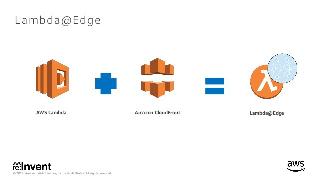
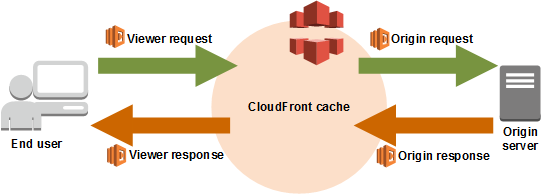
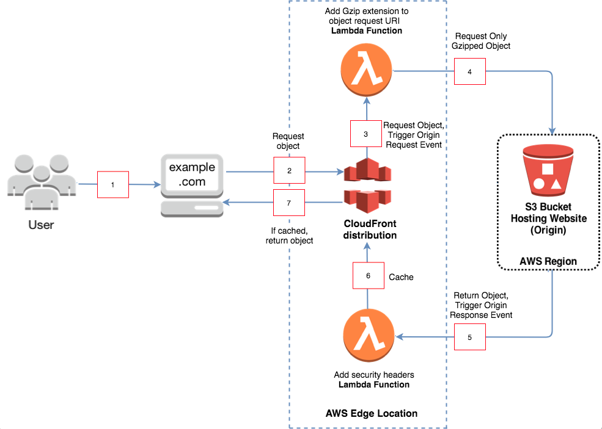

Before you start reading this article I recommend getting familiar with Lambda@Edge, CloudFront and S3.

Recently my team has decided to change its frontend architecture from using Nginx to AWS Lambda@Edge. We have used Nginx for the purpose of adding security headers to our files, but now that AWS Lambda@Edge is SOC2 complaint, there is no reason to use Nginx anymore. Additionally, we can take the opportunity to build a serverless application.


<br/>
In this article we will show how we managed to achieve additional security response headers while having an application that is using Amazon S3 to host it’s files. We will also review how we used Lambda@Edge to serve compressed files from S3 without using the auto compression feature in CloudFront.

Before we start, let’s have a quick overview of Lambda@Edge:

#### Lambda@Edge Overview

Lambda@Edge provides the ability to execute a Lambda function at an Amazon CloudFront Edge Location. This capability enables intelligent processing of HTTP requests at locations that are close (for the purposes of latency) to your customers. Why is this important? for example, our app’s Nginx location was in the US while the edge location of our customers was in China, as you can imagine, this can have a negative impact on latency. Also, another advantage was that we didn’t have to maintain a server running all the time, we could just let AWS scale that for us.

> Lambda@Edge is an extension of AWS Lambda that allows you to run Node.js code at global AWS locations
> Bring your own code to the Edge and customize your content very close to your users, improving end-user experience

When using CloudFront and Lambda@Edge you can use CloudFront’s events to invoke Lambda@Edge functions. You can run a Lambda@Edge function in response to four different CloudFront events: Viewer request, Origin request, Origin response, and Viewer response.


<br/>

In our case, the lambda functions are invoked by the following two events:

**Origin Request** — This event is triggered after CloudFront requests an object from the origin (S3). It has access to the request from CloudFront.

**Origin Response** — This event is triggered after the origin (S3) returns a response to a request. It has access to the response from the origin.

Keep in mind that you want to avoid the **Viewer Request** event as much as possible since it runs every time the client sends a request and will add latency and charges to your monthly bill for using Lambda@Edge.

The following diagram illustrates the sequence of events for triggering the Lambda@Edge functions:


<br/>

#### Here is how the process works:

1. Viewer requests website www.example.com.
   2 .If the object is already cached it moves on to step 7, otherwise it moves on to step 3.
2. CloudFront requests the object from the origin, in this case an S3 bucket, which in turn causes CloudFront to trigger the origin request event.
3. We need to trigger an “origin request” Lambda function, where it forwards the request to S3 bucket asking for only a gzipped object.
4. S3 returns the object, which in turn causes CloudFront to trigger the origin response event.
5. The “origin response” Lambda function is triggered, it adds security response headers and the resulting output is cached and served by CloudFront.
6. CloudFront returns the object from the cache to the viewer.

#### Here is how the compression process works:

1. Compress the files using Gzip algorithm.
2. Upload the compressed files to S3.
3. Add “Content-Length” header as an allowed header to the CORS configuration of your S3 bucket, this header is used by the browser to determine when it can reuse a connection.
4. Disable the auto compression feature in CloudFront.
5. Use Lambda@Edge to change the request URI to request only gzipped files and return a ‘content-encoding’ header in the response.

#### Here is an example of the lambda functions:

The **origin request** lambda function:

```javascript
/**
 * Function registered on 'Origin Request' CloudFront Event
 */
exports.handler = (event, context, callback) => {
  const request = event.Records[0].cf.request
  try {
    if (request.uri) {
      // Change URI to always use gzipped resources.
      request.uri = request.uri + '.gz'
    }
  } catch (e) {
    console.log('origin request handler - an error occurred: ', e)
  } finally {
    callback(null, request)
  }
}
```

The **origin response** lambda function:

```javascript
/**
 * Function registered on 'Origin Response' CloudFront Event
 */
exports.handler = (event, context, callback) => {
  const response = event.Records[0].cf.response
  try {
    const requestUri = event.Records[0].cf.request.uri

    // Check if the request uri has extension of a compressed file,
    // if so - add the corresponding header
    // The keys in the headers object are lowercase versions of the
    // header names in the HTTP request.
    if (requestUri.endsWith('.gz')) {
      response.headers['content-encoding'] = [
        {
          key: 'Content-Encoding',
          value: 'gzip'
        }
      ]
    }
    // here you can add the security headers you wish to add the
    // response
    response.headers['strict-transport-security'] = [
      {
        key: 'Strict-Transport-Security',
        value: 'max-age=31536000; includeSubdomains'
      }
    ]
    response.headers['x-content-type-options'] = [
      {
        key: 'X-Content-Type-Options',
        value: 'nosniff'
      }
    ]
    response.headers['x-frame-options'] = [
      {
        key: 'X-Frame-Options',
        value: 'SAMEORIGIN'
      }
    ]
    response.headers['referrer-policy'] = [
      {
        key: 'Referrer-Policy',
        value: 'same-origin'
      }
    ]
    response.headers['x-xss-protection'] = [
      {
        key: 'X-XSS-Protection',
        value: '1; mode=block'
      }
    ]
    response.headers['accept-ranges'] = [
      {
        key: 'Accept-Ranges',
        value: 'bytes'
      }
    ]
    response.headers['content-security-policy'] = [
      {
        key: 'Content-Security-Policy',
        value: "frame-ancestors 'self'"
      }
    ]
  } catch (e) {
    console.log('origin response handler - an error occurred: ', e)
  } finally {
    callback(null, response)
  }
}
```

You can read more about the security header [here](https://www.keycdn.com/blog/http-security-headers).

Now, you are probably asking why not use the auto compression feature in CloudFront?

Let’s see what you gain by not doing so:

1. After every change in your S3 files, the first web request to those files will result in a network latency since CloudFront will have to fetch them from the origin to its cache. By enabling auto compression we’re adding an additional penalty to this latency for compressing the file before it’s being cached. So, if you zip your files in advance, you spare your users from experiencing this latency. Even though it will happen only to the first user that asks for these files, it’s still going to happen at every CloudFront Edge location. So there are a bunch of users who’ll experience a lag every time you deploy, and that’s not the experience you want your users to have.
2. You can also use another algorithm for compression, like Brotli. Javascript files compressed with Brotli are 14 percent smaller then javascript files compressed with Gzip. Since not all browsers support Brotli, you can upload both Gzip and Brotli files to S3, and use the WhiteList Headers to choose Accept-Encoding request header as the header you want CloudFront to base caching on.
3. You are using less space on S3, which means less money spent.

To sum it up, we saw how we can use Lambda@Edge, CloudFront and S3 to customize our response headers and serve compressed files, where we gain the powerful advantage of improving the latency and adding security headers.

Customize the headers and changing URIs are not the only thing you can do with Lambda@Edge. You can also implement a serverless authorization, run A/B testing and much more, you can view some examples [here](https://docs.aws.amazon.com/AmazonCloudFront/latest/DeveloperGuide/lambda-examples.html).

Useful links:

1. [Building serverless websites with lambda@edge](https://www.slideshare.net/AmazonWebServices/building-serverless-websites-with-lambdaedge-aws-online-tech-talks)
2. [AWS Lambda@Edge workshops](https://github.com/aws-samples/aws-lambda-edge-workshops)
3. [A/B testing on AWS CloudFront with Lambda@Edge](https://medium.com/buildit/a-b-testing-on-aws-cloudfront-with-lambda-edge-a22dd82e9d12)
