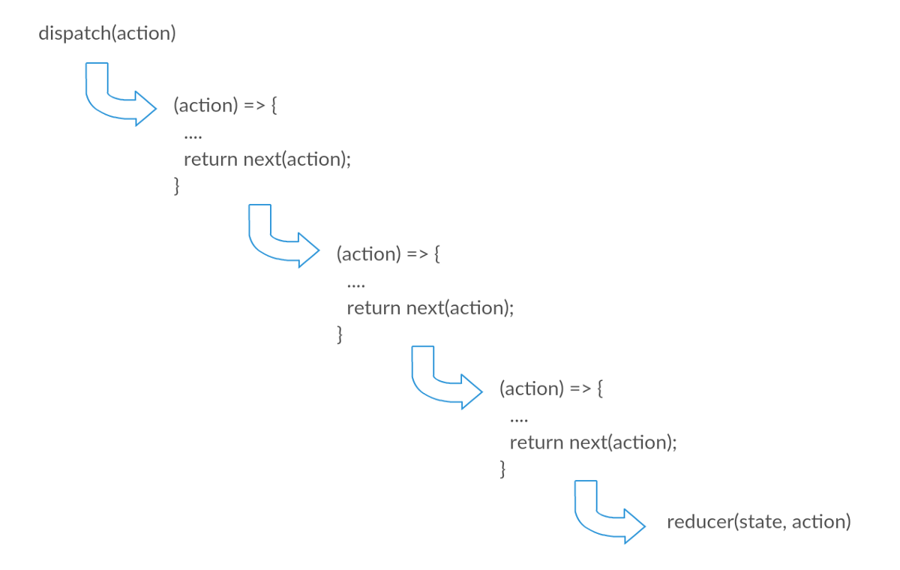

Is Redux giving you a headache? Do you feel frustrated navigating Redux’s code base? In this article, we will implement the core functionality of Redux in approximately 30 lines of code!

**TL;DR** - here’s our implementation of createStore and combineReducers, which cover the most common APIs of Redux.

createStore

```javascript
const createStore = (reducer, initialState = {}, middlewares = []) => {
  let state = initialState
  const listeners = []

  // final step - call the reducer and invoke the listeners
  let finalMiddleware = action => {
    state = reducer(state, action)
    listeners.forEach(listener => listener())
    return state
  }
  // the middleware API is constructed of getState and dispatch
  const middlewareAPI = {
    getState: () => state,
    dispatch: action => finalMiddleware(action)
  }
  // evalutate the first function in the structure of the middlewares
  const newMiddleWares = middlewares.map(middleware =>
    middleware(middlewareAPI)
  )
  // go over the new middlewares reversed and evaluate the second function in the structure
  // the second function receives the third fucntion of the next middleware
  // this way we can make sure that when the developer will call next(action)
  // he will acually execute the next middleware's most inner funciton
  for (let i = newMiddleWares.length - 1; i >= 0; i--) {
    finalMiddleware = newMiddleWares[i](finalMiddleware)
  }

  return {
    ...middlewareAPI,
    subscribe: listener => {
      listeners.push(listener)
      return () => {
        listeners.splice(listeners.indexOf(listener), 1)
      }
    }
  }
}
```

combineReducers

```javascript
combineReducers = reducers => {
  const reducerKeys = Object.keys(reducers)

  return (state = {}, action) => {
    let hasChanged = false
    const nextState = {}

    reducerKeys.forEach(key => {
      nextState[key] = reducers[key](state[key], action)
      hasChanged = hasChanged || nextState[key] !== state[key]
    })

    return hasChanged ? nextState : state
  }
}
```

Let’s look at the API reference for Redux. The first item on the list there is createStore, which we’re going to implement right now!

**createStore receives 3 parameters:**

1. reducer
2. initial state
3. enhancers (for simplicity we will use only middlewares)

**createStore returns an object with the following functions:**

1. getState
2. dispatch
3. subscribe

First, we’ll create the wireframe for createStore:

```javascript
const createStore = (reducer, preloadedState = {}, middlewares = []) => {
    return {
      getState: () => {...},
      dispatch: (action) => {...},
      subscribe: (listener) => {...}
    };
}
```

OK, now that we have the wireframe, we can start implementing it step by step.

First of all, we need to add a local variable named state that is initialized with the initialState passed to the createStore function. Since getState just returns the state we can easily implement it:

```javascript
let state = initialState;
return {
  getState: () => state,
  ...
}
```

Another simple implementation is subscribe:

subscribe is a function that receives a listener and returns an unsubscribe function which will remove the listener so that it is no longer called on store changes.

```javascript
const listeners = [];
return {
  subscribe: (listener) => {
    listeners.push(listener);
    return () => {
      listeners.splice(listeners.indexOf(listener), 1);}
    }
  },
  ...
}
```

Before we proceed to dispatch let’s implement the last step of our Redux implementation, which is evaluating the reducer, calling the listeners, and returning the new state:

```javascript
let state = initialState
const listeners = []
let dispatchAction = action => {
  state = reducer(state, action)
  listeners.forEach(listener => listener())
  return state
}
```

Now, dispatch is a function that receives an action and triggers state changes to the store. Basically, it calls the last step with the action it receives:

```javascript
return {
  dispatch: (action) => dispatchAction(action),
  ...
}
```

In the above implementation we used only the reducer to trigger state changes to the store, but what about our middlewares? What about all the side effects we want to execute before Redux changes the state? Before we do that let’s explore the structure of the middleware:

```javascript
/* A */ (middlewareAPI) => /* B */ (next) => /* C */ (action) => {
  ....
  return next(action);
}
```

A middleware is a function that returns another function that returns another function, and so on… But what's interesting is that **function B of the current middleware, receives a reference to function C of the next middleware in the array**. This composition enables us to call the next middleware from the current middleware and so on until we cover all of them. Only then we can continue to the reducer evaluation. What we have here is actually a chain of middlewares!

Let’s dive into the most interesting part of our implementation:

```javascript
let state = initialState
const listeners = []
let finalMiddleware = action => {
  state = reducer(state, action)
  listeners.forEach(listener => listener())
  return state
}
const middlewareAPI = {
  getState: () => state,
  dispatch: action => finalMiddleware(action)
}
const newMiddleWares = middlewares.map(middleware => middleware(middlewareAPI))
for (let i = newMiddleWares.length - 1; i >= 0; i--) {
  finalMiddleware = newMiddleWares[i](finalMiddleware)
}
```

Note that we changed dispatchAction to finalMiddleware. Don’t worry, it will all make sense when we finish everything!

First, we evaluate each middleware by calling it with the middleware API. Now newMiddleWares is a collection of functions with the following structure:

```javascript
(next) => (action) => {
  ....
  return next(action);
}
```

At the last step, we go over the new middlewares in reverse where we evaluate each middleware with the previously executed value. This part is a little bit confusing so let’s start with the last middleware.

The last middleware receives the first value of finalMiddleware, which is to evaluate the reducer, and it returns the last function in the middleware’s structure. finalMiddleware is now updated with that function.

The middleware before it will receive that function and return its last function in the structure. We repeat this process until we reach the first middleware.

At the end, the finalMiddleware will be the first middleware in the collection, so when we invoke dispatch it will call the first middleware.


<br/>

In the above diagram, we can see that the next parameter in each middleware is a **reference to the function getting the action in the next middleware in the array**.

Let’s review our final implementation of **createStore**:

```javascript
const createStore = (reducer, initialState = {}, middlewares = []) => {
  let state = initialState
  const listeners = []

  // final step - call the reducer and invoke the listeners
  let finalMiddleware = action => {
    state = reducer(state, action)
    listeners.forEach(listener => listener())
    return state
  }
  // the middleware API is constructed of getState and dispatch
  const middlewareAPI = {
    getState: () => state,
    dispatch: action => finalMiddleware(action)
  }
  // evalutate the first function in the structure of the middlewares
  const newMiddleWares = middlewares.map(middleware =>
    middleware(middlewareAPI)
  )
  // go over the new middlewares reversed and evaluate the second function in the structure
  // the second function receives the third fucntion of the next middleware
  // this way we can make sure that when the developer will call next(action)
  // he will acually execute the next middleware's most inner funciton
  for (let i = newMiddleWares.length - 1; i >= 0; i--) {
    finalMiddleware = newMiddleWares[i](finalMiddleware)
  }

  return {
    ...middlewareAPI,
    subscribe: listener => {
      listeners.push(listener)
      return () => {
        listeners.splice(listeners.indexOf(listener), 1)
      }
    }
  }
}
```

Now, we can move on to the next part in the API reference which is - combineReducers:

**combineReducers receives 1 parameter:**

1. reducers (object)

**combineReducers returns:**

1. a function that receives a state and an action and returns a state

The wireframe is pretty simple:

```javascript
combineReducers = reducers => {
  return (state = {}, action) => {
    return state
  }
}
```

The function that combineReducers returns is actually a reducer itself!
And what does a reducer do? It takes a state and an action and returns a new state!

So all we need to do is go over all the reducers and evaluate each of them with their corresponding state. After the iteration completes we return the new state!

```javascript
combineReducers = reducers => {
  const reducerKeys = Object.keys(reducers)

  return (state = {}, action) => {
    let hasChanged = false
    const nextState = {}

    reducerKeys.forEach(key => {
      nextState[key] = reducers[key](state[key], action)
      hasChanged = hasChanged || nextState[key] !== state[key]
    })

    return hasChanged ? nextState : state
  }
}
```

Notice hasChanged that we haven’t talked about. A core part of Redux is structural sharing, which means that if a certain part of the state tree wasn’t changed, we don’t change its reference. Let’s look at an example:

```javascript
state
|-- part-a
|-- part-b
| |-- part-b-1
| |-- part-b-2
|-- part-c
```

So, if we change part-b-1 in our state, we don’t want part-a or part-c or part-b-2 to lose their original reference since they weren’t changed. The ones that do need to change are part-b-1 part-b and state. That’s why we have hasChanged, in order to return the newly created state if some parts of the tree that did in fact change.

I encourage you to go and try to implement it by yourself! Don’t look at the implementation, just take a look at the APIs, understand what they actually do and dive in. You will see it’s not as difficult as you might think:

1. createStore - https://redux.js.org/api/createstore
2. combineReducers - https://redux.js.org/api/combinereducers
3. store - https://redux.js.org/api/store

As an exercise, see how hard it is to add replaceReducer and bindActionCreators to your implementation!

That's it! hope you enjoyed it!
